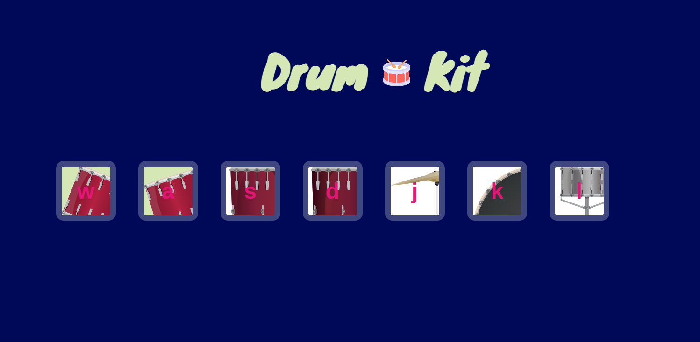

<h1 align="center">Drum Kit</h1>

Hands on project to end the module of javascript, to capture the clicks and keys press to make a sound.  

  

  <a href="#-techs">Techs</a>&nbsp;&nbsp;&nbsp;|&nbsp;&nbsp;&nbsp;
  <a href="#-project">Project</a>&nbsp;&nbsp;&nbsp;|&nbsp;&nbsp;&nbsp;
  <a href="#-learning">Learning</a>&nbsp;&nbsp;&nbsp;|&nbsp;&nbsp;&nbsp;
  <a href="#-license">License</a>

  

 

## 🚀 Techs

This project was developed using:

- HTML
- CSS
- Git
- Javascript

## 💻 Project

Web Page that simulate a drum kit, with differents sound effects.

## 📑 Learning

During the development of this web page was using JS to know what button was pressed and what square was clicked.

## 📝 License

Project is under MIT License.

---